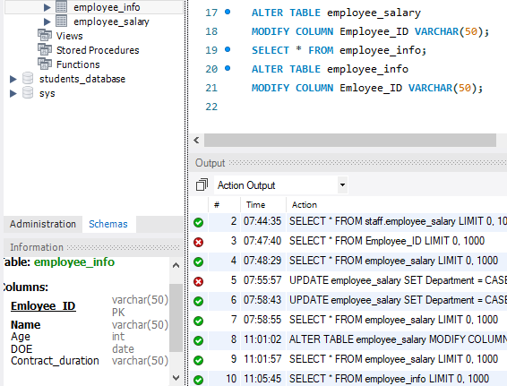

# Updating and Modifying data in MySQL
# INTRODUCTION:
- For this tasks,the commands or syntax used in renaming a table,changing of columns,creating new columns,updating an existing table and changing of data types will be implored.
- # Problem Statement:
- Renaming an existing table,changing of an existing Columns,creating a new column,changing of data types in an already existing table,running a query and updating an existing table are problems this task seeks to solve.
- ## Result/Discussion:
- The first task is to change a table NAME, It requires that an already created table "Staff_Info and Staff_Salary be changed from their initial names to "Employee_Info" and Employee_Salary" respectively.
- The snipshots below shows the command or syntax for changing an already existing table name
- .
- ---
- .
- ---
- The second task is to Rename an existing column, it requestS that the ID columns in the both tables created be changed from its initial name as ID to Employee_ID
- The snipshot below shows the command and syntax for changing an existing column name.
- .
- ---
- .
- ---
- The third task request that a new column be created in the Employee_Salary table and it should be named "Department".
- The snipshot below shows the tables and syntax used for creating a new column in an existing  table
- .
- ---
The third task is to Update data within a table and updating multiple rows.it requires that the Employees with specific IDs be updated to the following departments
- ID 1, 3, 7 TO I.T Department
- ID 2, 5, 9 TO Advertising Department
- ID 4, 6, 8. 10 TO Communication Department
- The snipshot below shows the table and command used.
- .
- ---
- The fourth task is to "change Data type".it request that the data type of the IDs in the both columns be changed to "Text data type".
- The snipshot below shows the table and syntax for changing of data type.
- 
- ---
- 
- ---
- The fifth task is to run a Query. It request that a Query be run that returns the month,year and day each employee came into the company.
- The snipshot below shows the table that returns the month,year and day each employee came into the company.the syntax used here is "SELECT YEAR, MONTHNAME, DAYNAME, SELECT * FROM"
- .
- ---
- The sixth task is to run a Query. It requests that a query be run that adds 10(ten) years to the year the employees came into the company as their year_of_Exit.
- The snipshot below shows the table.the syntax used here is "DATE_ADD, SELECT * FROM"
- .
- ---
- The last task is to update table,it request that the Employee_Info table be updated with the above changes.
- The snipshot below shows the table updated with the above changes
- .
- ---
### **CONCLUSION**:
- The task details the basic command in MYSQL use to modify and update date and also the date and time function,with these commands implored,it was possible to solve the problems in this task.
